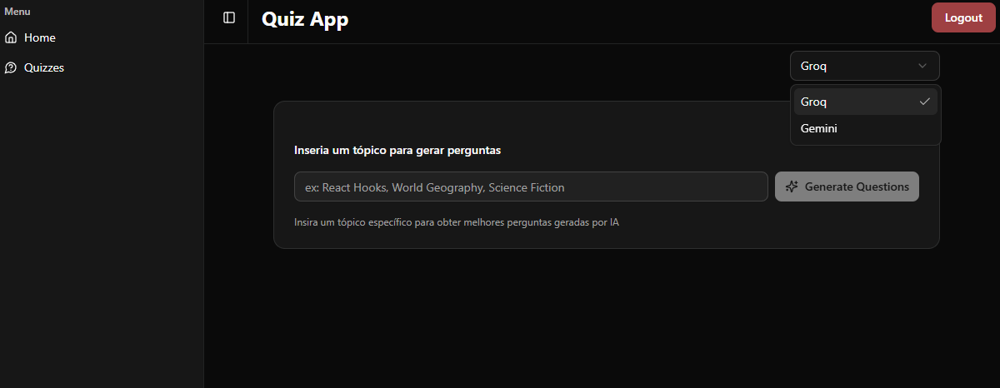
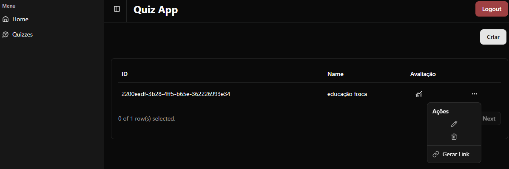
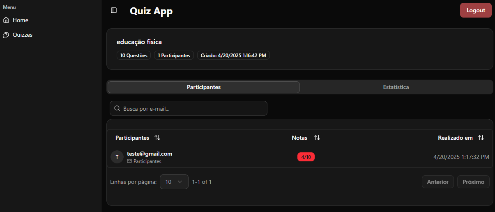
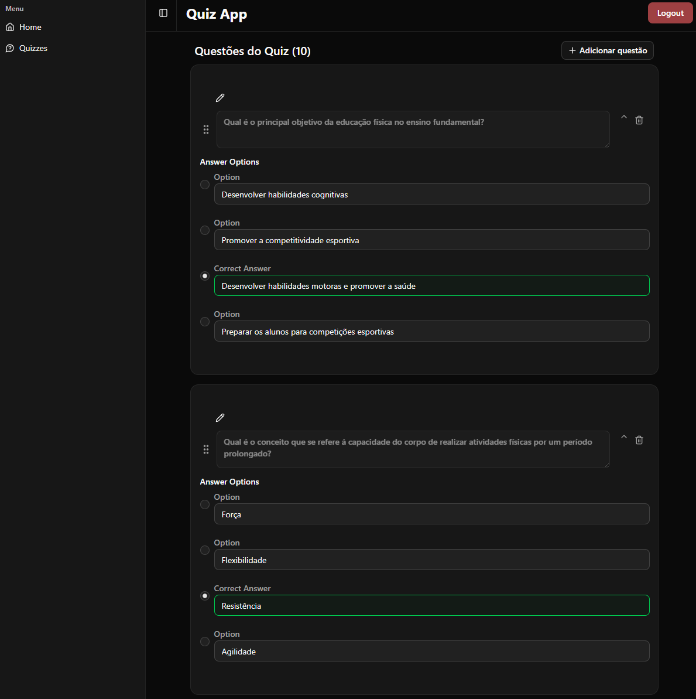
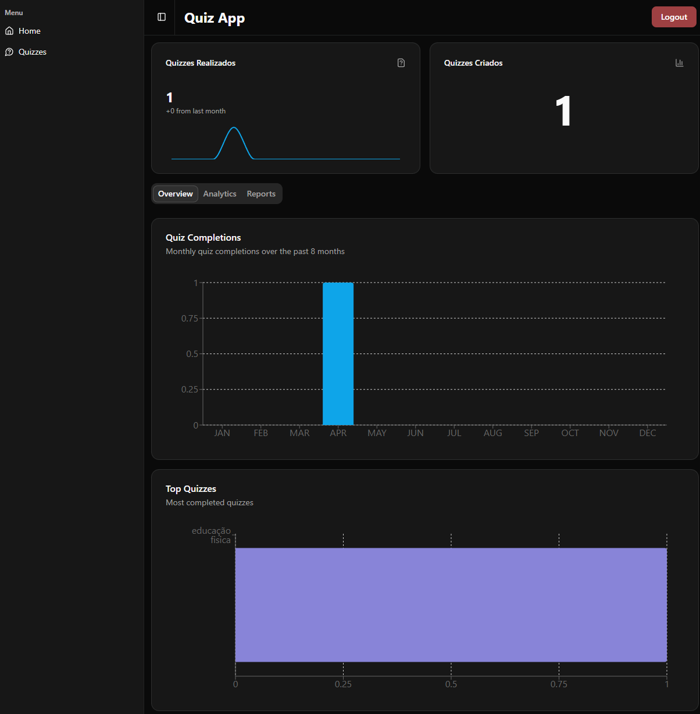
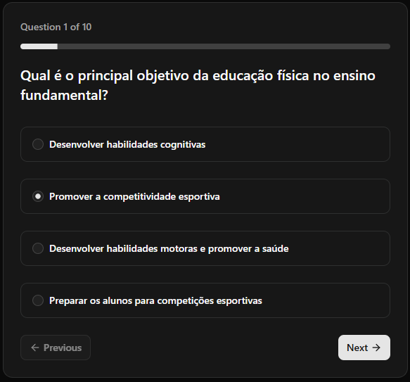
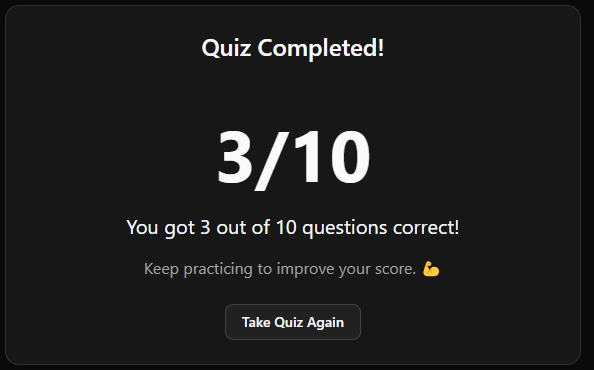

# Problema Identificado

O sistema educacional público no Brasil enfrenta vários problemas, como:

- Falta de professores
- Salas de aula superlotadas
- Dificuldade em usar tecnologia no ensino

Para ajudar nesses desafios, esta proposta busca oferecer uma solução tecnológica que auxilie os professores na criação de atividades avaliativas e interativas de forma prática e eficiente.

O objetivo é apoiar o trabalho dos docentes, facilitando a produção de conteúdos didáticos.

# Solução Proposta

## Visão Geral

O sistema é uma plataforma web que ajuda professores a criar quizzes usando inteligência artificial. Os alunos podem responder as atividades, e os professores recebem relatórios de desempenho.

### Funcionalidades

#### Para Professores

- Cadastro e Login: Acesso seguro à plataforma.
- Gerar Quizzes com IA: Escolha entre os modelos Gemini ou Groq e defina o tema da avaliação.
- Gerenciar Quizzes: Editar, excluir ou compartilhar quizzes via link.
- Relatórios de Desempenho: Ver estatísticas como:
  - Média da turma
  - Maiores e menores notas
  - Gráficos de desempenho

#### Para Alunos

- Acessar o Quiz: Basta clicar no link compartilhado.
- Registrar E-mail: Informar um e-mail para identificação.
- Responder a Atividade: Realizar o quiz online.

#### Benefícios

- Praticidade: Criação rápida de avaliações com IA.
- Acompanhamento: Dados de desempenho em tempo real.
- Acesso Fácil: Alunos respondem sem necessidade de cadastro.

✏️ Objetivo: Simplificar a criação e aplicação de quizzes, economizando tempo dos professores e melhorando o feedback sobre o aprendizado.

# QuizSchool

QuizSchool é uma aplicação desenvolvida para criar, gerenciar e realizar quizzes interativos. O projeto foi construído utilizando tecnologias modernas como React, Next.js, TailwindCSS e PostgreSQL, com suporte a APIs para geração de perguntas e análises de desempenho.

## Funcionalidades Principais

- **Criação de Quizzes**: Permite criar quizzes personalizados com perguntas e respostas.
- **Edição de Quizzes**: Ferramentas para editar perguntas, respostas e configurações de quizzes.
- **Realização de Quizzes**: Interface amigável para que os usuários respondam quizzes e recebam feedback imediato.
- **Análise de Desempenho**: Estatísticas detalhadas sobre a performance dos participantes.
- **Geração Automática de Perguntas**: Integração com APIs para gerar perguntas automaticamente com base em tópicos e níveis de dificuldade.

## Tecnologias Utilizadas

- **Frontend**: React, Next.js, TailwindCSS
- **Backend**: Node.js, Drizzle ORM, PostgreSQL
- **APIs**: Integração com OpenAI e Google Gemini para geração de perguntas
- **Bibliotecas de UI**: Radix UI, Lucide React
- **Gráficos e Visualizações**: Recharts

## Estrutura do Projeto

### Diretórios Principais

- **`src/Components`**: Contém os componentes reutilizáveis da aplicação, como botões, tabelas, gráficos e formulários.
- **`src/app`**: Gerencia as páginas e rotas da aplicação, incluindo as páginas de quizzes, dashboard e autenticação.
- **`backend/Infra/Repository`**: Contém os repositórios para interação com o banco de dados, como `QuizzRepository` e `EvaluationRepository`.
- **`src/http`**: Configuração de clientes HTTP para comunicação com APIs externas.
- **`src/db`**: Configuração do banco de dados utilizando Drizzle ORM.

### Principais Componentes

- **`QuizzMainControl`**: Gerencia a criação e edição de quizzes.
- **`QuestionEditor`**: Interface para editar perguntas e respostas.
- **`QuizTaker`**: Interface para os usuários realizarem quizzes.
- **`EvaluationQuizz`**: Exibe estatísticas e participantes de quizzes.
- **`ParticipantQuizz`**: Lista os participantes e suas pontuações.
- **`StatisticsQuizz`**: Mostra gráficos e análises de desempenho.

### APIs

- **`/api/quiz`**: Gerencia operações CRUD para quizzes.
- **`/api/chat`**: Integração com APIs de geração de perguntas.
- **`/api/dashboard`**: Fornece dados analíticos para o dashboard.

## Configuração e Execução

### Pré-requisitos

- Node.js
- Docker
- PostgreSQL

### Instalação

1. Clone o repositório:

   ```sh
   git clone <url-do-repositorio>
   cd quizschool
   ```

2. Suba o banco de dados PostgreSQL com o docker compose:

   ```sh
   docker-compose up -d
   ```

3. Execute as migrations do Drizzle:
   ```sh
   npx drizzle-kit push
   ```

### Prints da aplicação








